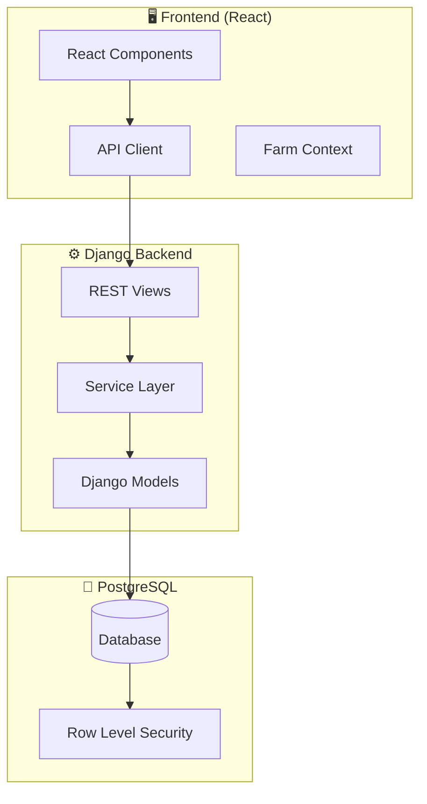
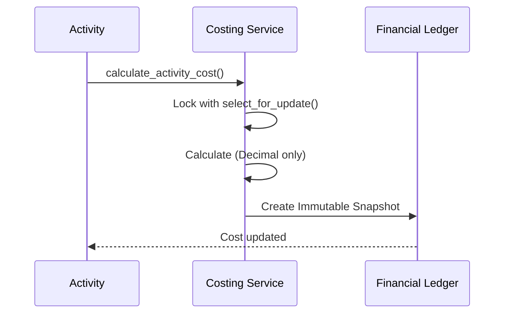

# 🏗️ هندسة نظام AgriAsset 2025

## الملخص التنفيذي
نظام إدارة الأصول الزراعية المتكامل يدير المزارع، المحاصيل، المخزون، والتكاليف.

---

## 📐 الهيكل المعماري



---

## 🔒 طبقة الأمان (RLS)


### السياسات المطبقة:
- `financialledger_farm_isolation`
- `activity_isolation`
- `cropplan_isolation`
- `inventory_isolation`

---

## 💰 تدفق المنطق المالي



---

## 📁 هيكل المجلدات

```
backend/
├── smart_agri/
│   ├── core/
│   │   ├── models/      # 14 نموذج
│   │   ├── services/    # 26 خدمة
│   │   ├── api/         # REST endpoints
│   │   └── tests/       # 45 ملف اختبار
│   └── accounts/        # إدارة المستخدمين
└── migrations/          # 95 هجرة

frontend/
├── src/
│   ├── api/generated/   # API المولد
│   ├── components/      # 19 مكون
│   └── pages/          # 30 صفحة
└── dist/               # البناء النهائي
```

---

## 🧠 الخدمات الحرجة (The Brain)

| الخدمة | الوظيفة | الحماية |
|--------|---------|---------|
| `costing.py` | حساب التكاليف | `STRICT_MODE=True` |
| `tree_inventory.py` | مخزون الأشجار | `select_for_update` |
| `cost_allocation.py` | توزيع التكاليف | `Decimal` only |

---

**آخر تحديث:** 2026-01-28
